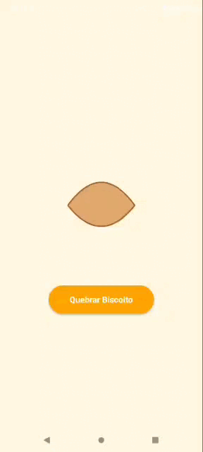

# 🥠 Fortune Cookie App

Um aplicativo simples e divertido feito com **React Native** usando **Expo**, que simula a abertura de um biscoito da sorte e exibe frases motivacionais!

## 📱 Preview

O app exibe um biscoito da sorte estilizado em SVG. Ao clicar em **"Quebrar Biscoito"**, o biscoito se abre e mostra uma frase aleatória. É possível clicar em **"Tentar Novamente"** para reiniciar.





## 🚀 Tecnologias Utilizadas

- [React Native](https://reactnative.dev/)
- [Expo](https://expo.dev/)
- [react-native-svg](https://github.com/software-mansion/react-native-svg)
- JavaScript (ES6+)

## 📦 Instalação

### 1. Clone o repositório

```bash
git clone https://github.com/franxd1/FortuneCookie-App.git
cd fortunecookieapp
```

### 2. Instale as dependências

```bash
npm install
```

### 3. Inicie o projeto com Expo

```bash
npm start
```

Ou use os comandos abaixo, dependendo da plataforma desejada:

```bash
npm run android  # Executa no Android
npm run ios      # Executa no iOS
npm run web      # Executa no navegador
```

## 📁 Estrutura do Projeto

```
fortunecookieapp/
├── components/
│   └── FortuneCookieSVG.js  # SVG customizado com o biscoito aberto ou fechado
├── App.js                   # Componente principal com lógica de sorteio
├── package.json             # Configurações do projeto
```

## ✨ Funcionalidades

- Sorteio de frases ao "quebrar" o biscoito.
- Visual interativo com ilustração SVG.
- Interface simples e intuitiva.

## 📜 Exemplo de Frases

- "Seu coração é sábio. Siga seus instintos."
- "O sucesso está mais perto do que você imagina."
- "A sorte favorece os corajosos. Não tenha medo!"

## ✅ Requisitos

- Node.js e npm instalados
- Expo CLI global:

```bash
npm install -g expo-cli
```

- Emulador Android, Xcode ou dispositivo físico com Expo Go

## 📝 Licença

Este projeto é livre para uso e modificação. Sinta-se à vontade para contribuir!

---

